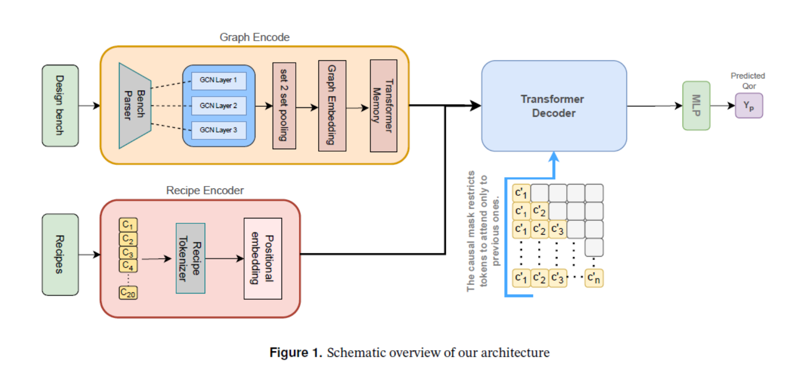
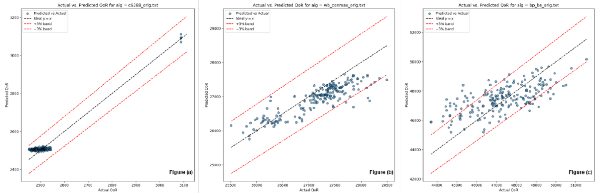
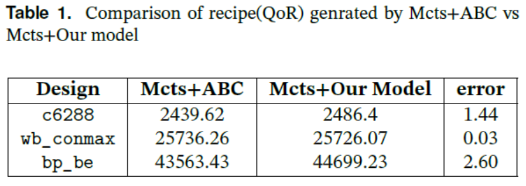

# Power Prediction of circuit using GNN and Transformer

This project predicts the **Quality of Result (QoR / power)** of digital circuits given a **design (AIG netlist)** and a **synthesis recipe**.
It combines **graph neural networks** (for circuits) with a **causal transformer** (for recipes), and supports training, evaluation, fine-tuning, and **recipe search with MCTS and outputs the optimized circuit design based on power consumption.**

---

##  What We Did (Step by Step)

1. **Data Generation**

   * Built a random recipe generator (20 ops per recipe) to get diverse synthesis flows.
   * Ran recipes through **ABC** to collect step-wise QoR (1..20).

2. **Graph Encoding**

   * Parsed `.bench` files into graphs.
   * Used **3-layer GCN + Set2Set pooling** to embed each circuit.

3. **Recipe Encoding**

   * Tokenized recipes with a fixed vocabulary.
   * Used a **RecipeCausalTransformer** with causal masking.

4. **Cross-Attention Fusion**

   * Decoder layers apply **multi-layer cross-attention** between recipe tokens and graph embedding.
   * Predict QoR at every recipe step.

5. **Training Objective**

   * Weighted MSE with design-dependent β.
   * Added a ±1% penalty loss → improves tolerance accuracy.

6. **Fine-Tuning**

   * Few-shot adaptation using KMeans to pick diverse shots.
   * Freeze backbone, train prediction head.

7. **Recipe Search with MCTS**

   * Plugged the trained model into **MCTS**.
   * Found new recipes close to ABC results but much faster.

##  Repo Structure

```
aig-power-prediction-GNN-Transformer/
│── main.py                 # CLI: train / test / finetune / mcts / all
│── requirements.txt
│── src/
│   ├── dataset.py          # Dataset + caching
│   ├── parse.py            # .bench → PyG graph
│   ├── models.py           # GCN + Transformer + cross-attention
│   ├── utils.py            # Losses, prediction utils
│   ├── train.py            # Training loop
│   ├── evaluate.py         # Evaluation scripts
│   ├── finetune.py         # Few-shot fine-tuning
│   └── mcts.py             # Model-guided recipe search
```

---

##  Usage

### Train

```bash
python main.py train --epochs 20 --batch_size 16
```

### Test

```bash
python main.py test --csv data/test.csv --model models/best.pth
```

### Fine-tune

```bash
python main.py finetune --pretrained models/best.pth --ft_csv data/ft.csv
```

### MCTS Search

```bash
python main.py mcts --model models/finetuned.pth --design bp_be_orig.txt --recipe "st;" --mcts_iters 500
```

---

---

##  Results (Highlights)

* **Accuracy (±3%)** improved from **89.7% → 91.5%** with adaptive loss.
* Model-based MCTS finds near-optimal recipes with <3% error vs ABC.

##  Model Architecture
<p align="center">
  
</p>

---

## Results on some designs
<p align="center">
  
</p>

---

## Results Comparison
<p align="center">
  
</p>


---

## Acknowledgements

* [ABC Synthesis Tool](https://people.eecs.berkeley.edu/~alanmi/abc/)
